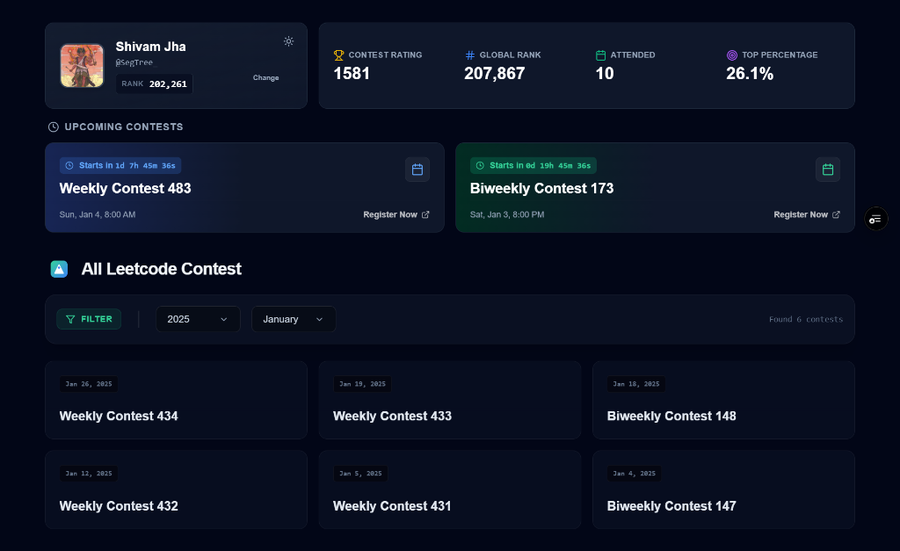

# All LeetCode Contest - ASCEND



## 🚀 About The Project

**All LeetCode Contest** is a specialized dashboard designed for competitive programmers and software engineering candidates to practice past LeetCode contests in a focused, distraction-free environment.

Retrieving and organizing past contests on the official platform can be cumbersome. This application provides a streamlined interface to browse, filter, and simulate contests from the entire LeetCode archive.

## 🎯 Improving Candidate Performance

This tool is built to help candidates **ASCEND** in their rankings by solving the core problems of contest practice:

-   **Simulated Pressure**: The built-in **Focus Mode** replicates the 90-minute contest window, helping you build speed and anxiety resilience.
-   **Structured Practice**: Easily filter contests by Year and Month to target specific time periods or recent trends.
-   **Progress Tracking**: View your real-time LeetCode contest rating, global rank, and attendance stats at a glance.
-   **Distraction-Free**: A clean, premium "Dark Mode" UI that keeps you focused on the problems, not the noise.

## ✨ Key Features

-   **Archive Access**: Instant access to weekly and bi-weekly contests dating back to 2014.
-   **Real-time Synchonization**: Fetches your live profile stats directly from LeetCode.
-   **Smart Filtering**: Drill down into specific years and months to find relevant problem sets.
-   **Premium UI**: A modern, responsive interface built with Tailwind CSS and Framer Motion.

## 🛠️ Built With

-   **Frontend**: React, Vite, Tailwind CSS
-   **Backend**: Node.js, Express (Proxy Server)
-   **API**: LeetCode GraphQL API

## 🏁 Getting Started

### Prerequisites

-   Node.js installed on your machine.

### Installation

1.  **Clone the repository**
    ```bash
    git clone https://github.com/yourusername/all-leetcode-contest.git
    cd all-leetcode-contest
    ```

2.  **Install Dependencies**
    ```bash
    npm install
    ```

3.  **Run the Application**
    ```bash
    npm run dev
    ```
    -   **Frontend**: `http://localhost:5173`
    -   **Server**: `http://localhost:5000`

---
*Built with ❤️ for the Competitive Programming Community.*
